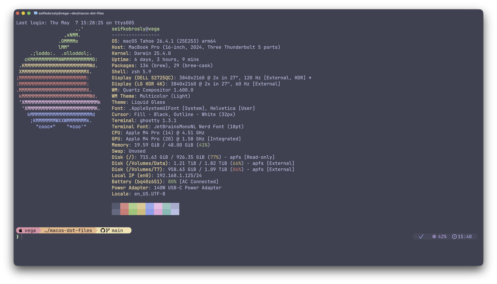

<div align="center">

# macOS dot files

**Opinionated dotfiles for a modern macOS terminal workflow**


</div>

---

## What you get



A fully configured terminal that feels fast and intentional — Catppuccin throughout, every classic Unix tool replaced with a modern equivalent, and a Starship prompt that surfaces your Claude AI session state (model, context usage, and cost) alongside git and language info.

---

## Philosophy

Modern CLI tools are better than their ancient counterparts. This setup replaces:

| Legacy | Modern | Why |
|--------|--------|-----|
| `ls` | `eza` | icons, git status, tree view |
| `cat` | `bat` | syntax highlighting, git gutter |
| `diff` | `git-delta` | side-by-side, Catppuccin themed |
| `cd` | `zoxide` | frecency-based jumping |
| `top` | `btop` | beautiful, interactive |
| `df` | `duf` | colorful disk usage |
| `du` | `dust` | visual tree |
| `ps` | `procs` | color, search, tree |
| `man` | `tldr` | practical examples |
| file browser | `yazi` | TUI, previews, bulk rename |
| shell history | `atuin` | encrypted sync, fuzzy search |

---

## Stack

### Core

| Component | Tool |
|-----------|------|
| Shell | Zsh + Sheldon |
| Prompt | Starship (Catppuccin Mocha) |
| Terminal | Ghostty |
| Editor | Neovim (LazyVim + Catppuccin) |
| Font | JetBrains Mono Nerd Font |
| Theme | Catppuccin Macchiato |
| Window Manager | AeroSpace (tiling, i3-inspired) |
| Runtime Manager | Mise (Node, Python, Go, Ruby, …) |
| History | Atuin (encrypted sync, fuzzy search) |
| System Info | Fastfetch (on every new session) |

### Modern CLI Tools

```
eza     bat     delta   zoxide  yazi
fzf     atuin   btop    duf     dust
procs   tldr    ripgrep fd      jq
```

### Apple Silicon

| Tool | Purpose |
|------|---------|
| `asitop` | Real-time CPU/GPU/ANE performance monitor |
| `mactop` | macOS system monitor (htop-style) |
| `batt` | Battery health + charging limit management |

### Git & Dev

| Tool | Purpose |
|------|---------|
| `lazygit` | TUI git client |
| `lazydocker` | TUI Docker client |
| `gitui` | Rust-based TUI git client |
| `git-delta` | Syntax-highlighted diffs (Catppuccin Frappe) |
| `mole` | macOS ultimate cleaner TUI |
| `xcodes` | Install & switch Xcode versions |
| `mint` | Swift CLI package manager |
| `neovim` | Editor (LazyVim) |

### Shell Plugins

Managed by [Sheldon](https://sheldon.cli.rs) (`~/.config/sheldon/plugins.toml`):

| Plugin | Purpose |
|--------|---------|
| `zsh-autosuggestions` | Fish-style inline suggestions |
| `zsh-syntax-highlighting` | Command highlighting |
| `alias-tips` | Reminds you when an alias exists |
| `fzf-tab` | Fuzzy tab completion |

---

## Starship Prompt

The prompt is the main event. Every segment is designed to be visible when you need it and invisible when you don't.

### Claude segment

Surfaces your active Claude Code session at a glance:

| Pill | Shows | Appears when |
|------|-------|--------------|
| Model | Active Claude model (e.g. `sonnet-4`) | Claude session is running |
| Context | Window usage gauge — color shifts yellow at 60%, red at 80% | Always (during session) |
| Cost | Accumulated session cost | After $0.10 spent |

### All segments

| Segment | Content |
|---------|---------|
| Claude | Model · context gauge · cost |
| Git | Branch + status (modified, staged, untracked, ahead/behind) |
| Languages | Swift, Node, Bun, Go, Python, Rust, Java, Kotlin — auto-detected per directory |
| Duration | Command execution time (shown for slow commands) |
| Exit status | Checkmark or ✗ on non-zero exit |
| Time | Current time (right side) |

---

## Installation

### Bootstrap (recommended)

One command sets up everything on a new machine — Homebrew, packages, Sheldon plugins, dotfiles, and mise runtimes:

```bash
curl -fsSL https://raw.githubusercontent.com/seifscape/macos-dot-files/main/bootstrap.sh | zsh
```

Or clone first if you prefer to inspect before running:

```bash
# SSH
git clone git@github.com:seifscape/macos-dot-files.git ~/path/to/macos-dot-files
# HTTPS
git clone https://github.com/seifscape/macos-dot-files.git ~/path/to/macos-dot-files
cd ~/path/to/macos-dot-files
./bootstrap.sh
```

Bootstrap will prompt for your git identity (name + email) and write it to `~/.gitconfig.local` which is not tracked.

### Manual installation

If you'd rather step through it yourself:

### Prerequisites

- macOS (Apple Silicon recommended)
- [Homebrew](https://brew.sh)
- Xcode Command Line Tools: `xcode-select --install`

### 1 — Clone

```bash
# SSH
git clone git@github.com:seifscape/macos-dot-files.git ~/path/to/macos-dot-files
# HTTPS
git clone https://github.com/seifscape/macos-dot-files.git ~/path/to/macos-dot-files
cd ~/path/to/macos-dot-files
```

### 2 — Homebrew packages

```bash
brew bundle --file=homebrew/Brewfile
```

### 3 — Sheldon plugins

```bash
sheldon lock
```

### 4 — Deploy with stow

```bash
./install.sh
```

### 5 — Font

```bash
brew install --cask font-jetbrains-mono-nerd-font
```

Set **JetBrains Mono Nerd Font** as your terminal font in Ghostty (already set in the included config).

### 6 — Manual steps

```bash
# Catppuccin theme for git-delta
git clone https://github.com/catppuccin/delta.git ~/.config/delta-themes

# Git identity (not tracked — create on each machine)
cat > ~/.gitconfig.local << 'EOF'
[user]
    name = Your Name
    email = you@example.com
EOF
```

---

## Structure

```
macos-dot-files/
├── install.sh              # legacy bootstrap (copies config to ~/)
├── zsh/                    # .zshrc  .zshenv  .zprofile
│                           # .aliases  .exports  .functions
│                           # .dev-functions.zsh  .zsh_bindings
├── sheldon/                # .config/sheldon/plugins.toml
├── nvim/                   # .config/nvim/ — LazyVim + Catppuccin + plugins
├── delta/                  # .config/delta/ — delta pager config (Catppuccin Frappe)
├── git/                    # .gitconfig  .gitignore_global
├── starship/               # starship.toml — Catppuccin Mocha + Claude segment
├── ghostty/                # terminal config + Catppuccin icon
├── homebrew/               # Brewfile
└── scripts/                # dev-updates.sh
```

---

## Quick Reference

| Command | Action |
|---------|--------|
| `z <dir>` | Jump to frecent directory (zoxide) |
| `Ctrl+R` | Atuin fuzzy history search |
| `Ctrl+T` | fzf fuzzy file picker |
| `y` | Yazi TUI file browser |
| `ll` | `eza` long list with icons |
| `la` | `eza` long list including hidden |
| `lt` | `eza` tree view |
| `lg` | git-aware eza listing (shows git status if in a repo) |
| `lazygit` | TUI git client |
| `gd` / `gds` | Delta-powered diffs |
| `hist` | Interactive atuin history search |
| `fbat` | fzf file picker with bat preview |
| `dev-refresh` | Update brew + mise |
| `batpick <file>` | Interactively pick a bat theme with fzf |
