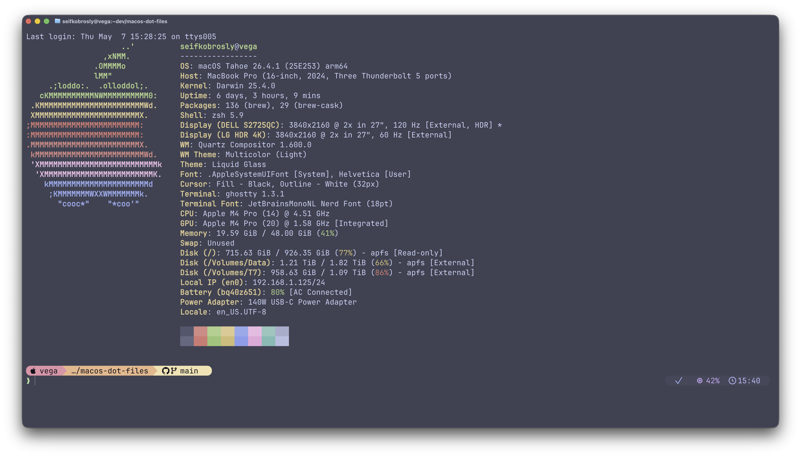

<div align="center">

# macOS dot files

**Opinionated dotfiles for a modern macOS terminal workflow**


</div>

---

## What you get



A fully configured terminal that feels fast and intentional — Catppuccin throughout, every classic Unix tool replaced with a modern equivalent, and a Starship prompt that surfaces your Claude AI session state (model, context usage, and cost) alongside git and language info.

---

## Philosophy

Modern CLI tools are better than their ancient counterparts. This setup replaces:

| Legacy | Modern | Why |
|--------|--------|-----|
| `ls` | `eza` | icons, git status, tree view |
| `cat` | `bat` | syntax highlighting, git gutter |
| `diff` | `git-delta` | side-by-side, Catppuccin themed |
| `cd` | `zoxide` | frecency-based jumping |
| `top` | `btop` | beautiful, interactive |
| `df` | `duf` | colorful disk usage |
| `du` | `dust` | visual tree |
| `ps` | `procs` | color, search, tree |
| `man` | `tldr` | practical examples |
| file browser | `yazi` | TUI, previews, bulk rename |
| shell history | `atuin` | encrypted sync, fuzzy search |

---

## Stack

### Core

| Component | Tool |
|-----------|------|
| Shell | Zsh + Sheldon |
| Prompt | Starship (Catppuccin Mocha) |
| Terminal | Ghostty |
| Editor | Neovim (LazyVim + Catppuccin) |
| Font | JetBrains Mono Nerd Font |
| Theme | Catppuccin Macchiato |
| Window Manager | OmniWM (tiling, Hyprland/Niri-inspired) |
| Launcher | Vicinae (open-source Raycast replacement) |
| Runtime Manager | Mise (Node, Python, Go, Ruby, …) |
| History | Atuin (encrypted sync, fuzzy search) |
| System Info | Fastfetch (on every new session) |

### Modern CLI Tools

```
eza     bat     delta   zoxide  yazi
fzf     atuin   btop    duf     dust
procs   tldr    ripgrep fd      jq
```

### Apple Silicon

| Tool | Purpose |
|------|---------|
| `asitop` | Real-time CPU/GPU/ANE performance monitor |
| `mactop` | macOS system monitor (htop-style) |
| `batt` | Battery health + charging limit management |

### Files & Transfer

| Tool | Purpose |
|------|---------|
| `croc` | Send files between machines, end-to-end encrypted |
| `rclone` | Rsync for cloud storage |
| `aria2` | Multi-protocol downloader with resume + segmenting |

### Git & Dev

| Tool | Purpose |
|------|---------|
| `lazygit` | TUI git client |
| `lazydocker` | TUI Docker client |
| `gitui` | Rust-based TUI git client |
| `git-delta` | Syntax-highlighted diffs (Catppuccin Frappe) |
| `mole` | macOS ultimate cleaner TUI |
| `xcodes` | Install & switch Xcode versions |
| `mint` | Swift CLI package manager |
| `neovim` | Editor (LazyVim) |

### Shell Plugins

Managed by [Sheldon](https://sheldon.cli.rs) (`~/.config/sheldon/plugins.toml`):

| Plugin | Purpose |
|--------|---------|
| `zsh-autosuggestions` | Fish-style inline suggestions |
| `zsh-syntax-highlighting` | Command highlighting |
| `alias-tips` | Reminds you when an alias exists |
| `fzf-tab` | Fuzzy tab completion |

---

## Starship Prompt

The prompt is the main event. Every segment is designed to be visible when you need it and invisible when you don't.

### Claude segment

Surfaces your active Claude Code session at a glance:

| Pill | Shows | Appears when |
|------|-------|--------------|
| Model | Active Claude model (e.g. `sonnet-4`) | Claude session is running |
| Context | Window usage gauge — color shifts yellow at 60%, red at 80% | Always (during session) |
| Cost | Accumulated session cost | After $0.10 spent |

### All segments

| Segment | Content |
|---------|---------|
| Claude | Model · context gauge · cost |
| Git | Branch + status (modified, staged, untracked, ahead/behind) |
| Languages | Swift, Node, Bun, Go, Python, Rust, Java, Kotlin — auto-detected per directory |
| Duration | Command execution time (shown for slow commands) |
| Exit status | Checkmark or ✗ on non-zero exit |
| Time | Current time (right side) |

---

## Installation

### Bootstrap (recommended)

One command sets up everything on a new machine — Homebrew, packages, Sheldon plugins, dotfiles, and mise runtimes:

```bash
curl -fsSL https://raw.githubusercontent.com/seifscape/macos-dot-files/main/bootstrap.sh | zsh
```

Or clone first if you prefer to inspect before running:

```bash
# SSH
git clone git@github.com:seifscape/macos-dot-files.git ~/path/to/macos-dot-files
# HTTPS
git clone https://github.com/seifscape/macos-dot-files.git ~/path/to/macos-dot-files
cd ~/path/to/macos-dot-files
./bootstrap.sh
```

Bootstrap will prompt for your git identity (name + email) and write it to `~/.gitconfig.local` which is not tracked.

### Manual installation

If you'd rather step through it yourself:

### Prerequisites

- macOS (Apple Silicon recommended)
- [Homebrew](https://brew.sh)
- Xcode Command Line Tools: `xcode-select --install`

### 1 — Clone

```bash
# SSH
git clone git@github.com:seifscape/macos-dot-files.git ~/path/to/macos-dot-files
# HTTPS
git clone https://github.com/seifscape/macos-dot-files.git ~/path/to/macos-dot-files
cd ~/path/to/macos-dot-files
```

### 2 — Homebrew packages

```bash
brew bundle --file=homebrew/Brewfile
```

### 3 — Sheldon plugins

```bash
sheldon lock
```

### 4 — Deploy with stow

```bash
./install.sh
```

### 5 — Font

```bash
brew install --cask font-jetbrains-mono-nerd-font
```

Set **JetBrains Mono Nerd Font** as your terminal font in Ghostty (already set in the included config).

### 6 — Manual steps

```bash
# Catppuccin theme for git-delta
git clone https://github.com/catppuccin/delta.git ~/.config/delta-themes

# Git identity (not tracked — create on each machine)
cat > ~/.gitconfig.local << 'EOF'
[user]
    name = Your Name
    email = you@example.com
EOF
```

---

## Structure

```
macos-dot-files/
├── install.sh              # stows symlinks into ~/ (safe to re-run)
├── bootstrap.sh            # full new-machine setup
├── zsh/                    # .zshrc  .zshenv  .zprofile
│                           # .aliases  .exports  .functions  .zsh_bindings
├── git/                    # .gitconfig  .gitignore_global
├── nvim/                   # .config/nvim/ — LazyVim + Catppuccin + plugins
├── sheldon/                # .config/sheldon/plugins.toml
├── delta/                  # .config/delta/ — delta pager config (Catppuccin Frappe)
├── starship/               # starship.toml — Catppuccin Mocha + Claude segment
├── ghostty/                # terminal config + Catppuccin icon + backgrounds
├── tmux/                   # .tmux.conf  .config/tmux/tmux.reset.conf
├── atuin/                  # .config/atuin/config.toml
├── btop/                   # .config/btop/btop.conf
├── gh-dash/                # .config/gh-dash/config.yml
├── mise/                   # .config/mise/config.toml
├── omniwm/                 # .config/omniwm/settings.toml — tiling WM
├── vicinae/                # .config/vicinae/settings.json — launcher
├── homebrew/               # Brewfile
└── scripts/                # dev-updates.sh
```

---

## Daily use

`install.sh` deploys **symlinks**, so each file in `$HOME` points back here:

```
~/.zshrc -> ~/Developer/macos-dot-files/zsh/.zshrc
```

There is only one real copy of every file. Editing `~/.zshrc` and editing
`zsh/.zshrc` are the same action — there is no sync step, and `git status` in
this repo always reflects what is actually live on the machine.

**Editing an existing file** — edit either path, then commit from this repo.

**Adding a new file** — create it inside the package directory, never directly
in `$HOME`, then re-stow:

```bash
vim zsh/.zlogin      # in the repo
./install.sh         # re-stows everything; safe to re-run
```

A config created directly in `$HOME` is invisible to git and becomes the next
thing to silently drift out of sync.

**Watch for tools that replace symlinks.** Some editors' atomic-save, and
`sed -i ''` on macOS, write a new file and rename it over the target — which
turns the symlink into a regular file, silently detaching it from the repo.
Check at any time with:

```bash
for f in ~/.zshrc ~/.zshenv ~/.zprofile ~/.aliases ~/.exports ~/.functions \
         ~/.zsh_bindings ~/.gitconfig ~/.gitignore_global ~/.tmux.conf; do
  [ -L "$f" ] || echo "detached (should be a symlink): $f"
done
```

Anything printed is a real file that has drifted; re-run `./install.sh` to
relink it. Note this discards whatever diverged, so diff it against the repo
copy first if the local version might hold changes worth keeping.

**Adding a new tool** — a config not yet tracked at all needs a package
directory that mirrors its path relative to `$HOME`, plus an entry in the
`PACKAGES` list in `install.sh`. Using zellij (`~/.config/zellij/config.kdl`)
as the example:

```bash
cd ~/Developer/macos-dot-files

# 1. mirror the path relative to $HOME
mkdir -p zellij/.config/zellij

# 2. MOVE the existing config in -- do not copy. stow refuses to overwrite
#    a real file at the target, so a leftover original blocks the package.
mv ~/.config/zellij/config.kdl zellij/.config/zellij/

# 3. register it in install.sh
#    PACKAGES=(zsh git nvim ... zellij)

# 4. deploy and commit
./install.sh
git add zellij install.sh && git commit -m "Track zellij config"
```

Skipping step 3 does not fail loudly on its own, so `install.sh` warns about
any package directory missing from `PACKAGES`:

```
[warn]  Unregistered directory (not in PACKAGES): zellij
```

Directories that live here without being deployed (`screenshots`, `.claude`)
are listed in `NOT_PACKAGES` and stay silent.

**Deliberately untracked:** `~/.gitconfig.local` holds your git identity so it
never reaches GitHub. It is `.gitignore`d and must be recreated on each machine
— see [Manual steps](#6--manual-steps).

---

## Desktop

Two pieces, each running independently.

| Piece | Config | Role |
|-------|--------|------|
| **OmniWM** | `~/.config/omniwm/settings.toml` | tiling, workspaces, borders, quake terminal |
| **Vicinae** | `~/.config/vicinae/settings.json` | launcher / command palette (`Ctrl+Space`) |

OmniWM replaced AeroSpace, and absorbed JankyBorders along with it — both are
uninstalled. It ships its own focus ring, so a separate borders daemon is
redundant. It also ships a workspace bar, a menu bar hider and a Ghostty quake
terminal, which is the SketchyBar job that was never worth wiring up by hand.

Requires macOS 26+ on Apple Silicon, and grants of Accessibility and Input
Monitoring on first launch. Never needs SIP disabled.

### Layout

`defaultLayoutType = "dwindle"` — Hyprland-style binary space partitioning, where
each new window bisects the focused tile along its wider axis. The `[niri]`
table is left at defaults, so `Option+Shift+L` flips a single workspace over to
scrolling columns without touching the config.

Note the settings file is generated: OmniWM owns the formatting and rewrites it
whenever you change something in its settings UI. Stow links the *directory*
(`~/.config/omniwm` → this repo), not the file, so those rewrites land in the
repo as a normal `git diff` and nothing clobbers the symlink. Hand-written
comments in it will not survive.

### Borders

Catppuccin mauve, matching the ring JankyBorders used to draw:

```toml
[borders]
enabled = true
width = 3.0

[borders.color]
red = 0.7764705882352941    # #c6a0f6
green = 0.6274509803921569
blue = 0.9647058823529412
alpha = 1.0
```

Corner radii are derived per window automatically, so it follows rounded window
shapes without a `style` key. Two things JankyBorders did that this cannot:
there is no inactive-window colour (the struct is `enabled`/`width`/`color`, one
colour only), and there is no blacklist — the Simulator and Droppy get a ring
again. Width is `3.0` rather than the old `6.0` because JankyBorders ran
`hidpi=off` and drew at 1x; OmniWM rounds to physical pixels, so half the number
is the same apparent weight.

### Launcher

**Vicinae** replaces Raycast — same command-palette shape, open source, native,
and no account or subscription attached to it. Bound to `Ctrl+Space`, themed
`catppuccin-mocha` to match everything else.

Its config is `~/.config/vicinae/settings.json`, stowed from this repo like
everything else. Worth knowing: Vicinae writes to that file itself whenever you
change a setting through the GUI, and it writes *through* the symlink — so GUI
tweaks land in the repo and show up as a normal `git diff`. The tradeoff is that
Vicinae owns the formatting, so hand-written comments in that file get rewritten
away. If you want commentary that survives, put it in a separate file and list
it in the `imports` array.

```bash
vicinae config default    # dump the full default config to see what is settable
```

### Keybindings

Stock defaults except **focus and move**, which are remapped from arrow keys to
`hjkl`. The reason is macOS, not muscle memory: a global hotkey on `Option+←/→`
would eat word-wise cursor movement, and `Option+Shift+←/→` word-wise
selection, in every text field on the machine. The cost is the dead-key glyphs
`˙ ∆ ˚ ¬`, which is the cheaper side of that trade.

`Control+Option+L` holds `toggleWorkspaceLayout`, moved off `Option+Shift+L`
where it collided with the new `move.right`.

| Key | Action |
|-----|--------|
| `alt` + `h` `j` `k` `l` | Focus window left / down / up / right |
| `alt-shift` + `h` `j` `k` `l` | Move window in that direction |
| `alt` + `1`…`9` | Switch to workspace |
| `alt-shift` + `1`…`9` | Move window to workspace |
| `ctrl-alt` + `1`…`9` | Focus column *n* |
| `ctrl-alt-tab` | Back and forth between last two workspaces |
| `alt-tab` | Focus previously focused window |
| `alt-enter` | Toggle fullscreen |
| `alt-t` | **Toggle column tabbed** — WM-level tabs |
| `alt-grave` | Quake terminal (Ghostty) |
| `alt-shift-o` | Overview |
| `ctrl-alt-l` | Flip workspace layout (dwindle ↔ niri) |
| `ctrl-alt-space` | Command palette |
| `ctrl-alt-m` | Open menu anywhere |
| `alt` + `-` / `=` | Container span −10% / +10% |
| `alt-shift` + `-` / `=` | Window span −10% / +10% |
| `alt` + `,` / `.` | Cycle preset size back / forward |
| `alt-shift-f` | Container to full span |
| `alt-shift-b` | Balance sizes |
| `alt-shift-r` | Raise all floating windows |
| `alt-home` / `alt-end` | Focus first / last column |
| `ctrl-cmd-tab` | Focus next monitor |

67 of 169 bindings are assigned; the rest arrive `Unassigned` — ten scratchpad slots,
`preselect` in four directions, per-monitor moves, `toggleFocusedWindowFloating`.
Fill them in `[[hotkeys]]` by `id`.

Nothing here uses a bare `cmd`, so app shortcuts are untouched, and nothing uses
a bare `ctrl`+arrow, so macOS *Move left/right a space* and Mission Control keep
working. `routing.mode = "macOS"` means OmniWM's workspaces ride on native
Spaces rather than replacing them.

`alt-t` is the one worth knowing. Ghostty's native macOS tabs are separate
`NSWindow`s stitched into a tab group, so a single window with six tabs looks
like six windows to any Accessibility-API window manager — the thing that made
AeroSpace unusable here. OmniWM's own tabbed columns are the way around it:
stop using `cmd-t`, and let the WM stack windows into a tab group it understands.

### Adding a window rule

Apps that resize themselves or open as panels fight tiling — float them.

```toml
[[appRules]]
bundleId = "com.example.app"
layout = "float"
```

Also available per rule: `titleRegex`, `assignToWorkspace`, `minWidth` /
`minHeight`, and `initialContainerPrimarySpan`. Settings live-reload on save.

---

## Quick Reference

| Command | Action |
|---------|--------|
| `z <dir>` | Jump to frecent directory (zoxide) |
| `Ctrl+R` | Atuin fuzzy history search |
| `Ctrl+T` | fzf fuzzy file picker |
| `y` | Yazi TUI file browser |
| `ll` | `eza` long list with icons |
| `la` | `eza` long list including hidden |
| `lt` | `eza` tree view |
| `lg` | git-aware eza listing (shows git status if in a repo) |
| `lazygit` | TUI git client |
| `gd` / `gds` | Delta-powered diffs |
| `hist` | Interactive atuin history search |
| `fbat` | fzf file picker with bat preview |
| `dev-refresh` | Update brew + mise |
| `batpick <file>` | Interactively pick a bat theme with fzf |
